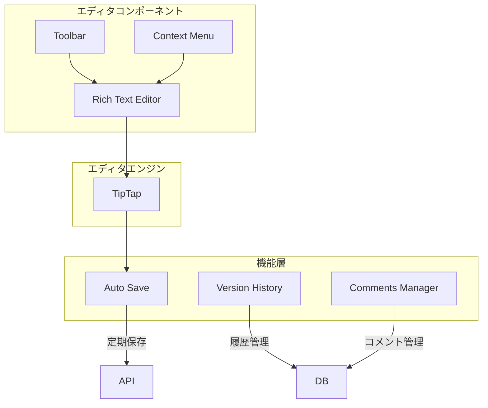
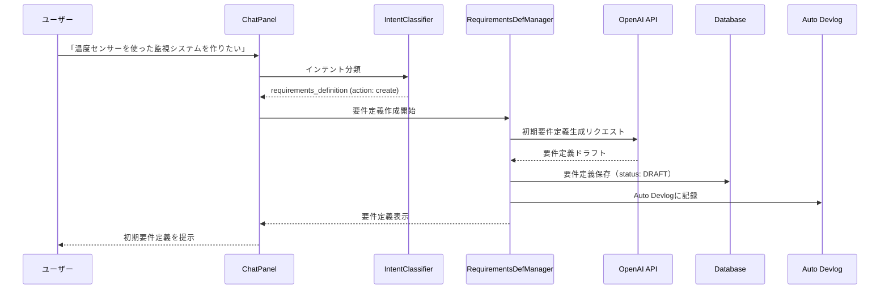
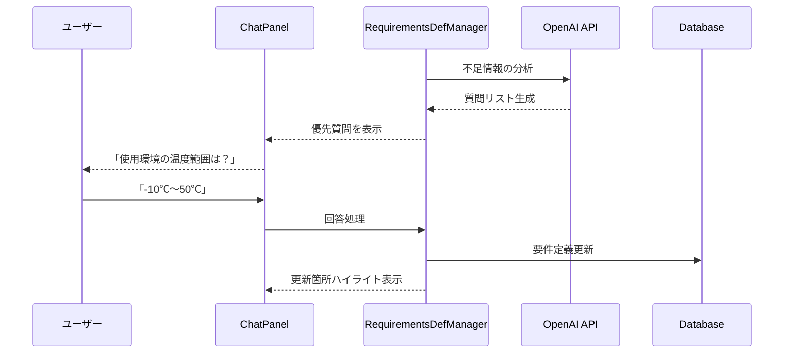
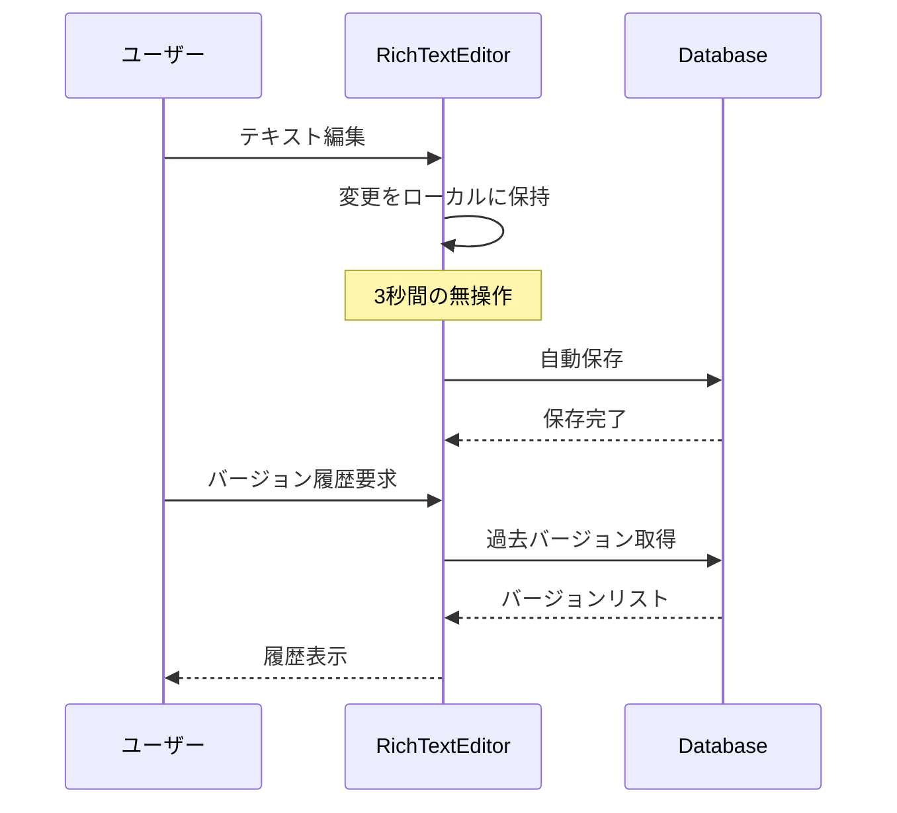

# 技術設計書

## 概要

本設計書は、AYA（AIアシスタント）との対話を通じて組み込みシステムの要件定義を段階的に詳細化する機能の技術設計を定義します。既存のORBOHシステムのChatPanel、Auto Devlog、およびインテント分類システムを拡張し、要件定義の作成から承認、システム提案までの一連のフローを実現します。

## アーキテクチャ

```mermaid
graph TB
    subgraph Frontend["フロントエンド層"]
        CP[ChatPanel]
        AD[Auto Devlog]
        RV[RequirementsViewer]
    end

    subgraph Logic["ビジネスロジック層"]
        CPL[ChatPanelLogic]
        IC[IntentClassifier]
        RDM[RequirementsDefManager]
        SSM[SystemSuggestionManager]
    end

    subgraph API["API層"]
        CHA[/api/chat]
        RDA[/api/requirements]
        ADA[/api/auto-devlog]
    end

    subgraph Data["データ層"]
        DB[(PostgreSQL)]
        FS[File Storage]
    end

    CP --> CPL
    AD --> ADA
    RV --> RDA

    CPL --> IC
    CPL --> RDM
    CPL --> SSM

    IC --> CHA
    RDM --> RDA
    SSM --> CHA

    CHA --> DB
    RDA --> DB
    ADA --> DB
    RDA --> FS
```

## 技術スタック

- **フロントエンド**: React 19.0.0 + Next.js 15.2.4 + TypeScript
- **バックエンド**: Next.js API Routes + TypeScript
- **データベース**: PostgreSQL 13+ + Prisma 6.11.0
- **AI連携**: OpenAI API (GPT-4)
- **認証**: NextAuth.js 4.24.11
- **スタイリング**: Tailwind CSS 4.x
- **状態管理**: React Hooks + Context API
- **リッチテキストエディタ**: TipTap 2.x
- **ドキュメントストレージ**: PostgreSQL (JSON) + S3互換ストレージ（画像用）

## コンポーネントとインターフェース

### 1. インテント分類システムの拡張

```typescript
// utils/ai/processing/intentClassifier.ts
export type UserIntent =
  | 'compatibility_check'
  | 'suggest_alternatives'
  | 'add_component'
  | 'suggest_system'
  | 'analyze_setup'
  | 'general_chat'
  | 'requirements_definition'; // 新規追加

export interface RequirementsIntent {
  action: 'create' | 'update' | 'review' | 'approve' | 'question';
  context?: string;
  targetSection?: string;
}
```

### 2. 要件定義管理コンポーネント

```typescript
// components/requirements/RequirementsDefManager.tsx
interface RequirementsDefManagerProps {
  projectId: string;
  onRequirementsUpdate: (requirements: RequirementsDocument) => void;
}

// components/requirements/RequirementsViewer.tsx
interface RequirementsViewerProps {
  requirements: RequirementsDocument;
  mode: 'view' | 'edit' | 'review';
  onApprove?: () => void;
  onEdit?: (section: string, content: string) => void;
}

// components/requirements/RequirementsEditor.tsx
interface RequirementsEditorProps {
  document: RequirementsDocument;
  onSave: (content: EditorContent) => void;
  onAutoSave?: (content: EditorContent) => void;
  collaborators?: Collaborator[];
}
```

### 4. リッチテキストエディタ実装

```typescript
// components/editor/RichTextEditor.tsx
interface RichTextEditorProps {
  initialContent: EditorContent;
  onChange: (content: EditorContent) => void;
  onSelectionChange?: (selection: EditorSelection) => void;
  placeholder?: string;
  readonly?: boolean;
}

// エディタ機能
interface EditorFeatures {
  // テキストフォーマット
  formatting: {
    bold: boolean;
    italic: boolean;
    underline: boolean;
    strikethrough: boolean;
    code: boolean;
  };

  // 構造要素
  blocks: {
    heading: 1 | 2 | 3 | 4 | 5 | 6;
    paragraph: boolean;
    bulletList: boolean;
    orderedList: boolean;
    taskList: boolean;
    blockquote: boolean;
    codeBlock: boolean;
    table: boolean;
  };

  // 挿入要素
  insert: {
    link: boolean;
    image: boolean;
    table: boolean;
    horizontalRule: boolean;
    diagram: boolean; // Mermaid対応
  };

  // コメント機能
  comments: {
    add: boolean;
    reply: boolean;
    resolve: boolean;
  };
}
```

### 5. ドキュメント編集アーキテクチャ



### 3. Auto Devlog拡張

```typescript
// components/monitoring/DevLog.tsx
interface DevLogDocument {
  id: string;
  type: 'ai-reference' | 'requirements' | 'decision' | 'memo';
  title: string;
  content: string;
  metadata: {
    createdAt: string;
    updatedAt: string;
    author: string;
    approvalStatus?: 'draft' | 'pending' | 'approved';
    version?: string;
  };
}
```

### API エンドポイント

```
# 要件定義管理
POST   /api/requirements/create      # 新規要件定義作成
GET    /api/requirements/:id         # 要件定義取得
PUT    /api/requirements/:id         # 要件定義更新
POST   /api/requirements/:id/approve # 要件定義承認
GET    /api/requirements/search      # 要件定義検索

# Auto Devlog拡張
POST   /api/auto-devlog/documents    # ドキュメント保存
GET    /api/auto-devlog/documents    # ドキュメント一覧
PUT    /api/auto-devlog/documents/:id # ドキュメント更新
```

## データモデル

```typescript
// Prismaスキーマ拡張
model RequirementsDocument {
  id            String   @id @default(cuid())
  projectId     String
  title         String
  content       Json     // TipTap/LexicalのJSONフォーマット
  contentHtml   String?  // HTMLキャッシュ（検索・表示用）
  contentText   String?  // プレーンテキストキャッシュ（検索用）
  version       String   @default("1.0.0")
  status        RequirementStatus @default(DRAFT)
  approvedAt    DateTime?
  approvedBy    String?
  createdAt     DateTime @default(now())
  updatedAt     DateTime @updatedAt

  project       Project  @relation(fields: [projectId], references: [id])
  decisions     Decision[]
  versions      DocumentVersion[]
  comments      Comment[]
  collaborators DocumentCollaborator[]
}

model DocumentVersion {
  id            String   @id @default(cuid())
  documentId    String
  version       String
  content       Json
  contentHtml   String?
  changes       Json?    // 差分情報
  createdBy     String
  createdAt     DateTime @default(now())

  document      RequirementsDocument @relation(fields: [documentId], references: [id])
  user          User @relation(fields: [createdBy], references: [id])
}

model Comment {
  id            String   @id @default(cuid())
  documentId    String
  threadId      String?  // スレッド化対応
  content       String
  selection     Json?    // コメント対象のテキスト範囲
  resolved      Boolean  @default(false)
  createdBy     String
  createdAt     DateTime @default(now())
  updatedAt     DateTime @updatedAt

  document      RequirementsDocument @relation(fields: [documentId], references: [id])
  user          User @relation(fields: [createdBy], references: [id])
}


model Decision {
  id            String   @id @default(cuid())
  requirementId String
  content       String
  context       String?
  importance    DecisionImportance @default(NORMAL)
  createdAt     DateTime @default(now())

  requirement   RequirementsDocument @relation(fields: [requirementId], references: [id])
}

enum RequirementStatus {
  DRAFT
  PENDING_APPROVAL
  APPROVED
  REJECTED
}

enum DecisionImportance {
  LOW
  NORMAL
  HIGH
  CRITICAL
}

```

## 処理フロー

### 要件定義作成フロー



### 対話による詳細化フロー



### リッチテキスト編集フロー



## エラーハンドリング

### エラーパターンと対処

1. **AI API エラー**
   - リトライ機構（最大3回、指数バックオフ）
   - フォールバックメッセージ表示
   - エラーログ記録

2. **データ整合性エラー**
   - バージョン管理による変更追跡
   - 自動バックアップ

3. **承認フローエラー**
   - 未承認時のシステム提案ブロック
   - 承認権限チェック
   - 承認履歴の追跡

## セキュリティ考慮事項

1. **認証・認可**
   - NextAuth.jsによるセッション管理
   - プロジェクトレベルのアクセス制御
   - 要件定義の編集権限管理

2. **データ検証**
   - 入力値のサニタイゼーション
   - XSS対策（React自動エスケープ）
   - SQLインジェクション対策（Prisma使用）

3. **APIセキュリティ**
   - レート制限の実装
   - APIキーの環境変数管理
   - HTTPSによる通信暗号化

## パフォーマンスとスケーラビリティ

1. **最適化戦略**
   - 要件定義の差分更新
   - チャット履歴の遅延読み込み
   - AI応答のストリーミング

2. **キャッシング**
   - 承認済み要件定義のキャッシュ
   - AI応答の一時キャッシュ
   - 静的リソースのCDN配信

3. **スケーリング**
   - Vercelのサーバーレス機能活用
   - データベース接続プーリング
   - 非同期処理の活用

## テスト戦略

### ユニットテスト

```typescript
// __tests__/utils/intentClassifier.test.ts
describe('IntentClassifier', () => {
  it('should classify requirements definition intent', () => {
    const result = classifyUserIntent('要件定義を作成したい');
    expect(result.intent).toBe('requirements_definition');
  });
});
```

### 統合テスト

```typescript
// __tests__/api/requirements.test.ts
describe('Requirements API', () => {
  it('should create new requirements document', async () => {
    const response = await fetch('/api/requirements/create', {
      method: 'POST',
      body: JSON.stringify({ projectId, initialPrompt }),
    });
    expect(response.status).toBe(201);
  });
});
```

### E2Eテスト

```typescript
// e2e/requirements-flow.spec.ts
test('Complete requirements definition flow', async ({ page }) => {
  await page.goto('/');
  await page.fill(
    '[data-testid="chat-input"]',
    '温度センサーシステムを作りたい',
  );
  await page.click('[data-testid="send-button"]');
  await expect(
    page.locator('[data-testid="requirements-viewer"]'),
  ).toBeVisible();
});
```

## 段階的実装計画

### フェーズ1: 基盤構築

1. IntentClassifierへのrequirements_definition追加
2. 基本的な要件定義データモデル実装
3. ChatPanelLogicの拡張

### フェーズ2: コア機能実装

1. 要件定義生成・更新機能
2. 対話による詳細化機能
3. Auto Devlogへの統合

### フェーズ3: 高度な機能

1. 承認フローの完全実装
2. 要件定義書ベースのシステム提案
3. 検索・エクスポート機能

## 既存システムとの統合ポイント

1. **ChatPanelLogic**: 新しいインテント処理の追加
2. **Auto Devlog**: ドキュメントタイプの拡張
3. **SystemSuggestion**: 要件定義書チェック機能の追加
4. **データベース**: 新しいテーブルとリレーションの追加
