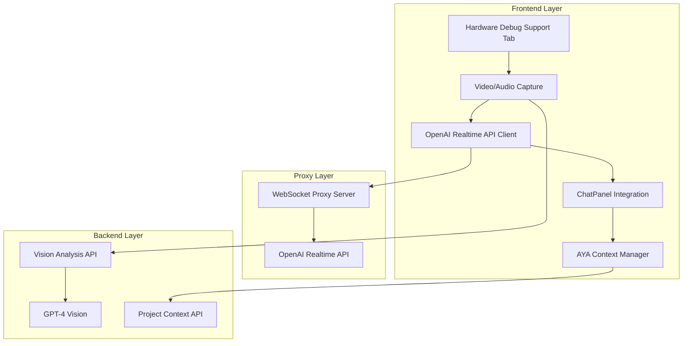

# Technical Design

## Overview
既存のVisualInformationコンポーネントを改修し、ChatPanelと統合することで、音声制御VLMによるハードウェアデバッグ支援を実現する。右側のConversationエリアを削除し、全ての対話をChatPanelに統一する。

## Architecture



## Technology Stack
- **Frontend**: React + TypeScript（既存）
- **リアルタイム通信**: OpenAI Realtime API + WebSocket
- **音声処理**: Web Audio API + MediaRecorder
- **画像処理**: Canvas API + GPT-4 Vision
- **UI統合**: 既存ChatPanelコンポーネント
- **プロキシ**: Node.js WebSocketプロキシ（既存）

## Components and Interfaces

### 1. HardwareDebugSupport Component（改修版）
```typescript
interface HardwareDebugSupportProps {
  projectId: string;
  onMessageSend: (message: ChatMessage) => void;
}

interface DebugState {
  isSessionActive: boolean;
  isWebcamOn: boolean;
  isMuted: boolean;
  debugContext: DebugContext;
}
```

### 2. ChatPanel統合
```typescript
interface DebugChatMessage extends ChatMessage {
  type: 'user' | 'assistant' | 'debug-visual' | 'debug-audio';
  debugMetadata?: {
    imageBase64?: string;
    audioTranscript?: string;
    measurementData?: any;
    ayaContext?: DebugContext; // 画像解析時に使用
  };
}
```

### 3. AYAコンテキスト連携
```typescript
interface DebugContext {
  systemDesign: SystemNode[];
  partsInfo: PartInfo[];
  compatibilityIssues: Issue[];
  previousDebugSessions: DebugSession[];
}
```

## API Endpoints

### 既存APIの拡張
```
POST /api/analyze-vision (既存を拡張)
  Request: {
    image: string (base64),
    text: string (ユーザーの音声プロンプト),
    context?: {
      systemDesign: SystemNode[],
      partsInfo: PartInfo[],
      compatibilityIssues: Issue[]
    }
  }
  Response: {
    analysis: string,
    debugSuggestions?: string[]
  }

GET /api/debug/context/:projectId
  - プロジェクトのデバッグコンテキスト取得

POST /api/debug/session
  - デバッグセッション記録
```

## Data Flow

1. **音声入力フロー**
   - マイク入力 → Realtime API → 音声認識
   - 認識結果をChatPanelにユーザーメッセージとして表示
   - 音声認識されたテキストを後続の画像解析で使用

2. **画像解析フロー**
   - カメラキャプチャ → analyze_webcam関数呼び出し
   - GPT-4 Visionに送信するデータ：
     - 画像データ（base64）
     - ユーザーの音声入力テキスト（マイクから認識されたプロンプト）
     - AYAコンテキスト（プロジェクトの部品情報、システム設計、互換性情報）
   - 解析結果をChatPanelに表示
   - デバッグ提案を音声で返答

3. **ChatPanel統合フロー**
   - 全ての対話履歴をChatPanelで一元管理
   - デバッグ固有の表示（画像サムネイル、測定値など）をサポート

## Data Models

### DebugSession
```typescript
interface DebugSession {
  id: string;
  projectId: string;
  startTime: Date;
  endTime?: Date;
  messages: DebugChatMessage[];
  diagnosis: string;
  resolution?: string;
  images: string[];
}
```

### RealtimeConfig
```typescript
interface RealtimeDebugConfig {
  modalities: ['text', 'audio'];
  voice: 'alloy';
  instructions: string; // AYAコンテキスト含む
  tools: [{
    name: 'analyze_webcam',
    function: AnalyzeWebcamFunction
  }];
}
```

## UI変更点

1. **Conversationエリアの削除**
   - 右側のConversationコンポーネントを完全削除
   - グリッドレイアウトを単一カラムに変更

2. **ChatPanel拡張**
   - デバッグメッセージ用の特別な表示形式追加
   - 画像サムネイル表示機能
   - 音声再生インジケーター

3. **コントロールの簡素化**
   - カメラ・マイクのON/OFFボタンのみ
   - カメラ選択は既存のまま維持

## Error Handling
- WebSocket接続エラー: 自動再接続とユーザー通知
- カメラ/マイクアクセス拒否: 明確なエラーメッセージ
- API応答遅延: ローディング表示とタイムアウト処理

## Security Considerations
- OpenAI APIキーはサーバー側で管理（プロキシ経由）
- カメラ・マイクの権限は明示的に要求
- デバッグセッションデータの適切な暗号化

## Performance & Scalability
- 画像キャプチャ間隔の最適化（2秒間隔）
- 音声データの効率的なストリーミング
- ChatPanel履歴の仮想スクロール実装

## Testing Strategy
- 単体テスト: 各コンポーネントの動作確認
- 統合テスト: ChatPanel連携の確認
- E2Eテスト: 音声入力から応答までのフロー
- 手動テスト: 実際のハードウェアでのデバッグシナリオ