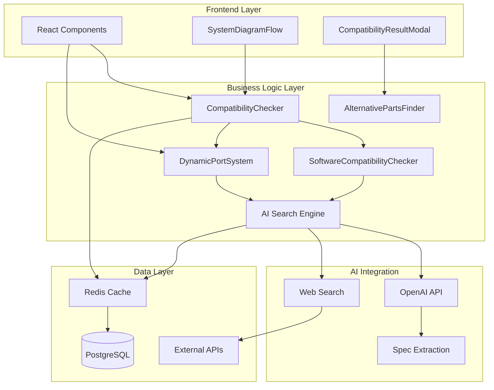
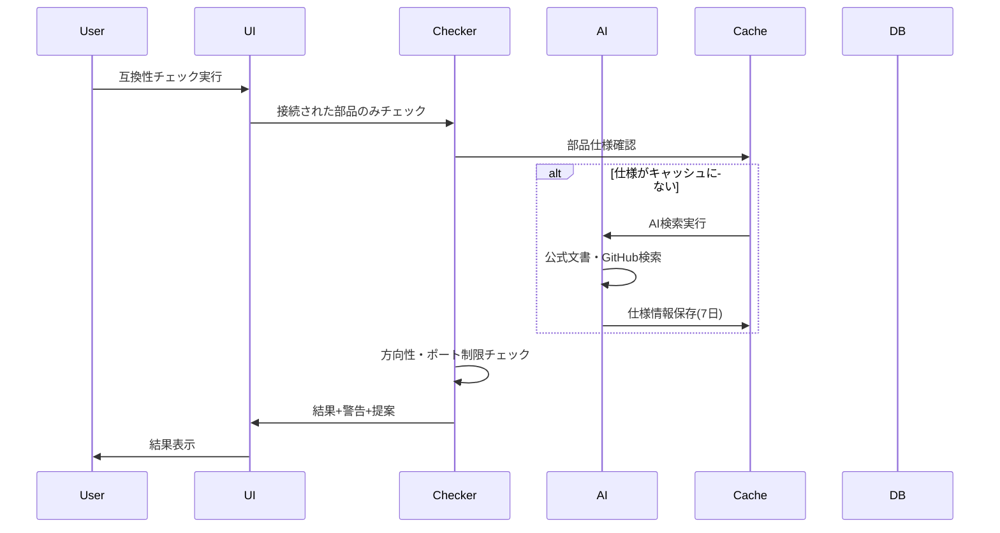
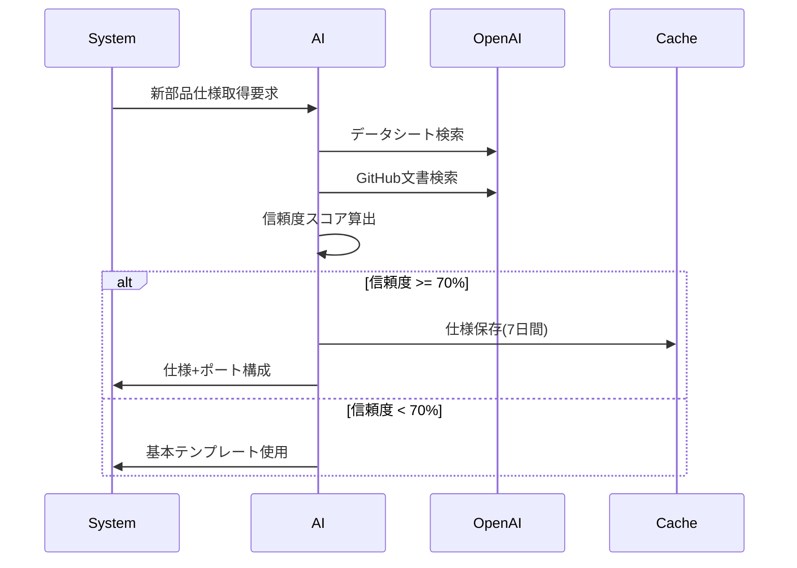

# 技術設計

## 概要

部品互換性確認機能のアップデートは、既存の高度な3段階互換性チェックシステムを基盤として、5つの主要機能拡張を実装します。現在のNext.js 15 + React 19 + TypeScriptアーキテクチャを活用し、AI検索による動的部品仕様取得、柔軟なポートシステム、最適化された接続チェックを統合します。

## アーキテクチャ



## 技術スタック

- **フロントエンド**: Next.js 15.2.4 + React 19 + TypeScript 5
- **UI ライブラリ**: Radix UI + Tailwind CSS 4.0 + shadcn/ui
- **状態管理**: React Hooks + カスタムフック
- **フローシステム**: @xyflow/react v12.8.1
- **データベース**: PostgreSQL + Prisma ORM v6.11.0
- **キャッシュ**: Redis (部品仕様キャッシュ用)
- **AI統合**: OpenAI API v5.8.2
- **テスト**: Jest + React Testing Library + Playwright
- **認証**: NextAuth.js v4.24.11

## コンポーネントとインターフェース

### 既存コンポーネントの拡張

#### EnhancedCompatibilityChecker
```typescript
interface EnhancedCompatibilityChecker {
  // 既存機能の拡張
  checkConnectionCompatibility(
    connections: Connection[],
    components: Node<NodeData>[]
  ): Promise<ConnectionCompatibilityResult>
  
  // 新機能: 方向性チェック
  validateConnectionDirection(
    connection: Connection,
    fromSpec: ComponentSpec,
    toSpec: ComponentSpec
  ): DirectionalityResult
  
  // 新機能: ポート制限チェック
  validatePortLimits(
    portId: string,
    currentConnections: Connection[]
  ): PortValidationResult
  
  // 新機能: リアルタイム制限管理
  monitorPortCapacity(
    ports: Port[],
    activeConnections: Connection[]
  ): PortCapacityStatus[]
  
  // 新機能: 接続制限の動的更新
  updateConnectionLimits(
    portId: string,
    newSpec: ComponentSpecification
  ): ConnectionLimitUpdate
}
```

#### DynamicPortSystem
```typescript
interface DynamicPortSystem {
  generatePortConfiguration(
    componentName: string
  ): Promise<PortConfiguration>
  
  getPortFromAI(
    componentName: string
  ): Promise<AIComponentSpec>
  
  validateConnectionToPort(
    portId: string,
    connectionType: 'power' | 'communication'
  ): ValidationResult
}
```

#### AISpecificationService
```typescript
interface AISpecificationService {
  fetchComponentSpecification(
    componentName: string
  ): Promise<ComponentSpecification>
  
  searchTechnicalDocuments(
    query: string,
    sources: string[]
  ): Promise<SearchResult[]>
  
  extractPortInformation(
    documentContent: string
  ): Promise<PortConfiguration>
}
```

### 新規コンポーネント

#### UnconnectedPartsWarning
```typescript
interface UnconnectedPartsWarning {
  detectUnconnectedParts(
    components: Node<NodeData>[],
    connections: Connection[]
  ): UnconnectedPart[]
  
  generateConnectionSuggestions(
    unconnectedParts: UnconnectedPart[]
  ): ConnectionSuggestion[]
}
```

#### ConnectionDirectionalityManager
```typescript
interface ConnectionDirectionalityManager {
  validatePowerDirection(
    connection: Connection
  ): DirectionalValidationResult
  
  validateCommunicationDirection(
    connection: Connection
  ): CommunicationValidationResult
  
  suggestVoltageLevelConversion(
    fromVoltage: string,
    toVoltage: string
  ): ConversionSuggestion[]
}
```

#### DynamicPortLayoutManager
```typescript
interface DynamicPortLayoutManager {
  generatePortLayout(
    portConfiguration: PortConfiguration,
    nodeSize: { width: number, height: number }
  ): PortLayout
  
  calculatePortPositions(
    ports: Port[],
    nodeGeometry: NodeGeometry
  ): PortPosition[]
  
  optimizePortArrangement(
    ports: Port[],
    connectionCounts: Record<string, number>
  ): OptimizedPortLayout
}

interface PortLayout {
  communicationPorts: PortPosition[]
  powerPorts: PortPosition[]
  groupedPorts: PortGroup[]
}

interface PortPosition {
  portId: string
  x: number
  y: number
  side: 'top' | 'right' | 'bottom' | 'left'
  icon: PortIcon
  label: string
}
```

#### MultiConnectionVisualizer
```typescript
interface MultiConnectionVisualizer {
  renderBranchedConnections(
    sourcePort: Port,
    connections: Connection[]
  ): BranchedConnectionElement
  
  calculateConnectionPaths(
    sourcePosition: PortPosition,
    targetPositions: PortPosition[]
  ): ConnectionPath[]
  
  optimizeConnectionRouting(
    connections: Connection[],
    nodePositions: NodePosition[]
  ): OptimizedRouting
}

interface BranchedConnectionElement {
  mainBranch: ConnectionPath
  subBranches: ConnectionPath[]
  junctionPoint: Point
  connectionLabels: ConnectionLabel[]
}
```

#### ComplexComponentManager
```typescript
interface ComplexComponentManager {
  renderExpandablePortView(
    component: ComplexComponent,
    expandedPorts: string[]
  ): ExpandablePortView
  
  managePortGroupVisibility(
    portGroups: PortGroup[],
    visibilityState: PortVisibilityState
  ): VisibilityResult
  
  generatePortDetailModal(
    component: ComplexComponent,
    selectedPort: Port
  ): PortDetailModal
}

interface ComplexComponent {
  id: string
  name: string
  portGroups: PortGroup[]
  totalPorts: number
  displayMode: 'compact' | 'expanded' | 'detailed'
}

interface PortGroup {
  groupId: string
  groupName: string
  groupType: 'communication' | 'power' | 'gpio'
  ports: Port[]
  isExpanded: boolean
  maxDisplayPorts: number
}
```

### API エンドポイント

```typescript
// 既存エンドポイントの拡張
POST /api/compatibility/check-enhanced
POST /api/ai-compatibility-verify       // 既存の拡張
POST /api/component-specification       // 新規
POST /api/port-configuration           // 新規
POST /api/connection-validation        // 新規

// データ管理
GET  /api/components/specifications
POST /api/components/specifications
PUT  /api/components/specifications/:id
```

## データフロー

### 互換性チェックフロー


### 動的部品仕様取得フロー


## データモデル

### 拡張されたNodeData
```typescript
interface EnhancedNodeData extends NodeData {
  // 既存フィールド継承
  title: string
  voltage?: string
  communication?: string
  
  // 新規追加
  portConfiguration?: PortConfiguration
  specificationSource?: SpecificationSource
  lastSpecUpdate?: string
}

interface PortConfiguration {
  ports: Port[]
  generatedBy: 'ai' | 'template' | 'manual'
  confidence?: number
  sources?: string[]
}

interface Port {
  id: string
  name: string
  type: 'power_in' | 'power_out' | 'communication'
  protocol?: 'I2C' | 'SPI' | 'UART' | 'PWM' | 'GPIO'
  voltage?: string
  maxConnections: number
  currentConnections: number
  required: boolean
  
  // 新規追加: ポート制限管理
  capacityStatus: PortCapacityStatus
  connectionRules: ConnectionRule[]
  visualState: PortVisualState
}

interface PortCapacityStatus {
  available: number
  used: number
  percentage: number
  status: 'available' | 'warning' | 'full' | 'exceeded'
  warningThreshold: number  // 警告表示の閾値（例: 80%）
}

interface ConnectionRule {
  ruleType: 'max_connections' | 'voltage_match' | 'protocol_match'
  constraint: any
  enforced: boolean
  errorMessage: string
}

interface PortVisualState {
  highlighted: boolean
  showCapacity: boolean
  errorState: boolean
  warningState: boolean
  availableConnectionIndicator: boolean
}
```

### 拡張されたConnection
```typescript
interface EnhancedConnection extends Connection {
  // 既存フィールド継承
  id: string
  source: string
  target: string
  
  // 新規追加
  sourcePortId?: string
  targetPortId?: string
  connectionType: 'power' | 'communication'
  voltage?: string
  protocol?: string
  validated: boolean
  validationResult?: ValidationResult
}
```

### AI検索結果
```typescript
interface ComponentSpecification {
  componentName: string
  powerSpecs: {
    input: PowerSpec[]
    output: PowerSpec[]
  }
  communicationSpecs: CommunicationSpec[]
  physicalSpecs?: PhysicalSpec
  confidence: number
  sources: string[]
  retrievedAt: string
  expiresAt: string
}

interface PowerSpec {
  voltage: string
  currentMax?: string
  type: 'input' | 'output'
}

interface CommunicationSpec {
  protocol: string
  pinCount: number
  maxDevices: number
  voltage: string
}
```

## エラーハンドリング

### 階層化エラーハンドリング戦略

```typescript
// レベル1: UI表示エラー
interface CompatibilityWarning {
  type: 'connection_limit' | 'voltage_mismatch' | 'unconnected_parts'
  severity: 'critical' | 'warning' | 'info'
  message: string
  suggestions: string[]
}

// レベル2: システムエラー
interface SystemError {
  type: 'ai_search_failed' | 'cache_unavailable' | 'spec_parsing_failed'
  fallbackStrategy: 'use_cache' | 'use_template' | 'skip_feature'
  userMessage: string
}

// レベル3: 致命的エラー
interface CriticalError {
  type: 'database_unavailable' | 'api_key_invalid'
  recoveryAction: string
  maintainerAlert: boolean
}
```

### フォールバック戦略
1. **AI検索失敗** → キャッシュデータ使用 → 基本テンプレート使用
2. **外部API障害** → オフラインモード切替
3. **部品仕様不明** → 汎用互換性チェック + 警告表示

## セキュリティ考慮事項

### API セキュリティ
- OpenAI APIキーの環境変数管理
- レート制限の実装（毎分100リクエスト）
- 入力値のサニタイゼーション

### データ保護
- 部品仕様情報の適切なキャッシュ期間設定
- 個人プロジェクトデータの分離
- 検索クエリのログ制限

### 認証・認可
```typescript
// API エンドポイント保護
middleware: [
  authenticate,      // NextAuth.js認証
  rateLimit,        // レート制限
  validateInput     // 入力値検証
]
```

## パフォーマンス・スケーラビリティ

### キャッシュ戦略
```typescript
interface CacheStrategy {
  // 短期キャッシュ（互換性結果）
  compatibilityResults: {
    ttl: '24時間',
    maxSize: '10,000件'
  }
  
  // 長期キャッシュ（部品仕様）
  componentSpecs: {
    ttl: '7日間',
    maxSize: '50,000件'
  }
  
  // 永続キャッシュ（基本テンプレート）
  templates: {
    ttl: '永続',
    updateTrigger: 'manual'
  }
}
```

### 最適化戦略
1. **接続チェック最適化**: O(n²) → O(connections)
2. **並列AI検索**: 複数部品仕様の同時取得
3. **遅延読み込み**: 部品仕様のオンデマンド取得
4. **バックグラウンド更新**: 期限切れ仕様の自動更新

## テスト戦略

### テスト階層
```typescript
// 単体テスト（90%カバレッジ目標）
- utils/enhancedCompatibilityChecker.test.ts
- utils/dynamicPortSystem.test.ts
- utils/aiSpecificationService.test.ts

// 統合テスト
- api/compatibility/integration.test.ts
- components/PartsManagement.integration.test.ts

// E2Eテスト（Playwright）
- flows/compatibility-check.e2e.ts
- flows/ai-specification-retrieval.e2e.ts
```

### モック戦略
```typescript
// OpenAI API モック
const mockOpenAI = {
  searchComponentSpec: jest.fn().mockResolvedValue({
    specification: mockSpec,
    confidence: 85,
    sources: ['official-datasheet.pdf']
  })
}

// Redis キャッシュ モック
const mockCache = new Map()
```

### テストデータ
- Arduino Uno, ESP32, Teensy 4.1の完全仕様
- 互換性問題のエッジケース
- AI検索失敗シナリオ

## 実装フェーズ

### フェーズ1: 基盤拡張（2週間）
- 既存CompatibilityCheckerの接続のみチェック対応
- DynamicPortSystemの基本実装
- 未接続部品警告の実装
- **新規**: PortCapacityStatusの基本実装

### フェーズ2: AI統合（2-3週間）
- OpenAI API統合とプロンプト最適化
- 部品仕様自動取得システム
- キャッシュシステム実装
- **新規**: AI取得仕様からのポート構成自動生成

### フェーズ3: UI拡張・高度機能（2-3週間）
- **新規**: DynamicPortLayoutManagerの実装
- **新規**: MultiConnectionVisualizerの実装
- **新規**: ComplexComponentManagerの実装
- 接続方向性判定システム
- 電圧レベル変換提案

### フェーズ4: 複雑部品対応（1-2週間）
- **新規**: Teensy 4.1級複雑部品の完全対応
- **新規**: ポートグループ管理システム
- **新規**: 展開可能ポートビューの実装
- **新規**: 分岐接続の視覚化とルーティング最適化

### フェーズ5: 品質保証・最適化（1週間）
- 包括的テストスイート（UI拡張部分含む）
- エラーハンドリング強化
- パフォーマンス最適化
- **新規**: 複数ポートシステムの負荷テスト

### 総期間: 8-11週間（従来の5-6週間から拡張）
**理由**: 要件5の複雑なポートシステム要求に完全対応するため、UI拡張フェーズを追加

### リスク軽減策
1. **段階的実装**: 基本ポートシステム → 複数ポート → 複雑部品の順
2. **プロトタイプ優先**: UI設計の不確実性を早期解決
3. **既存システム保護**: 新機能は既存機能に影響を与えない設計

## 接続線の視覚的区別システム

### 電力接続と信号接続の視覚仕様

#### 接続線視覚仕様の詳細定義
```typescript
interface ConnectionVisualSpec {
  // 電力接続の視覚仕様
  powerConnection: {
    hasArrow: true
    lineWidth: 4 | 6  // ピクセル
    style: 'solid' | 'double-line'
    colorScheme: VoltageColorMap
    flowAnimation: true  // 電力フローアニメーション
    arrowType: 'power-arrow'  // 電力専用矢印
    labelStyle: 'voltage-current'  // "5V/500mA"
  }
  
  // 信号接続の視覚仕様
  signalConnection: {
    hasArrow: boolean  // プロトコル依存
    lineWidth: 2  // ピクセル
    style: 'solid' | 'dashed' | 'dotted'
    colorScheme: ProtocolColorMap
    dataFlowIndicator: boolean  // データフロー表示
    arrowType: 'signal-arrow' | 'bidirectional-arrow'
    labelStyle: 'protocol-name'  // "I2C", "SPI"
  }
}

interface VoltageColorMap {
  '3.3V': '#FF7F00'    // オレンジ
  '5V': '#FF0000'      // 赤
  '12V': '#FFD700'     // 金色
  '24V': '#FF4500'     // 橙赤
  'battery_3.7V': '#8A2BE2'  // 紫
  'usb_5V': '#00FF00'  // USB緑
  'variable': '#808080' // グレー（可変電圧）
}

interface ProtocolColorMap {
  'I2C': '#0066CC'     // 青（双方向）
  'SPI': '#00AA00'     // 緑（単方向高速）
  'UART': '#AA00AA'    // 紫（双方向シリアル）
  'PWM': '#FF6600'     // オレンジ（制御信号）
  'GPIO': '#666666'    // グレー（汎用）
  'CAN': '#CC0066'     // マゼンタ（車載通信）
  'Ethernet': '#0080FF' // 水色（ネットワーク）
  'USB': '#00CCCC'     // シアン（USB通信）
}
```

### React Flow実装仕様

#### カスタム接続エッジコンポーネント
```typescript
// 電力接続エッジの実装
const PowerConnectionEdge: React.FC<EdgeProps> = ({ 
  id, 
  sourceX, 
  sourceY, 
  targetX, 
  targetY, 
  data 
}) => {
  const voltage = data.voltage
  const current = data.current
  const isHighVoltage = parseFloat(voltage) > 5
  
  const edgePath = getSmoothStepPath({
    sourceX,
    sourceY,
    targetX,
    targetY,
  })
  
  return (
    <>
      <path
        id={id}
        style={{
          strokeWidth: isHighVoltage ? 6 : 4,
          stroke: getVoltageColor(voltage),
          strokeLinecap: 'round',
          fill: 'none'
        }}
        className="react-flow__edge-path power-edge"
        d={edgePath}
        markerEnd="url(#power-arrow)"
      />
      
      {/* 電力フローアニメーション */}
      <path
        style={{
          strokeWidth: 2,
          stroke: '#FFFFFF',
          strokeDasharray: '8,4',
          fill: 'none',
          opacity: 0.8
        }}
        className="power-flow-animation"
        d={edgePath}
      />
      
      {/* 電圧・電流ラベル */}
      <EdgeLabelRenderer>
        <div className="power-label">
          <span className="voltage">{voltage}</span>
          <span className="current">{current}</span>
        </div>
      </EdgeLabelRenderer>
    </>
  )
}

// 信号接続エッジの実装
const SignalConnectionEdge: React.FC<EdgeProps> = ({ 
  id, 
  sourceX, 
  sourceY, 
  targetX, 
  targetY, 
  data 
}) => {
  const protocol = data.protocol
  const direction = data.direction
  const isBidirectional = direction === 'bidirectional'
  
  const edgePath = getSmoothStepPath({
    sourceX,
    sourceY,
    targetX,
    targetY,
  })
  
  return (
    <>
      <path
        id={id}
        style={{
          strokeWidth: 2,
          stroke: getProtocolColor(protocol),
          strokeDasharray: protocol === 'PWM' ? '4,2' : 'none',
          fill: 'none'
        }}
        className="react-flow__edge-path signal-edge"
        d={edgePath}
        markerEnd={isBidirectional ? 
          "url(#bidirectional-arrow)" : 
          "url(#signal-arrow)"
        }
      />
      
      {/* データフロー表示 */}
      {data.showDataFlow && (
        <path
          style={{
            strokeWidth: 1,
            stroke: getProtocolColor(protocol),
            strokeDasharray: '2,2',
            fill: 'none',
            opacity: 0.6
          }}
          className="data-flow-indicator"
          d={edgePath}
        />
      )}
      
      {/* プロトコルラベル */}
      <EdgeLabelRenderer>
        <div className="signal-label">
          <span className="protocol">{protocol}</span>
          {isBidirectional && <span className="direction">↔</span>}
        </div>
      </EdgeLabelRenderer>
    </>
  )
}
```

### カスタムマーカー定義
```typescript
const CustomMarkers = () => (
  <defs>
    {/* 電力用矢印（太い、赤系） */}
    <marker
      id="power-arrow"
      markerWidth="12"
      markerHeight="12"
      refX="10"
      refY="6"
      orient="auto"
      markerUnits="strokeWidth"
    >
      <path
        d="M2,2 L2,10 L10,6 z"
        fill="currentColor"
        strokeWidth="1"
        stroke="currentColor"
      />
    </marker>
    
    {/* 信号用矢印（細い、青系） */}
    <marker
      id="signal-arrow"
      markerWidth="8"
      markerHeight="8"
      refX="7"
      refY="4"
      orient="auto"
      markerUnits="strokeWidth"
    >
      <path
        d="M1,1 L1,7 L7,4 z"
        fill="currentColor"
        strokeWidth="0.5"
        stroke="currentColor"
      />
    </marker>
    
    {/* 双方向矢印 */}
    <marker
      id="bidirectional-arrow"
      markerWidth="10"
      markerHeight="8"
      refX="5"
      refY="4"
      orient="auto"
      markerUnits="strokeWidth"
    >
      <path
        d="M1,2 L4,4 L1,6 M6,2 L9,4 L6,6"
        fill="none"
        strokeWidth="1"
        stroke="currentColor"
      />
    </marker>
  </defs>
)
```

このアーキテクチャにより、既存システムの優秀な基盤を活かしつつ、AI駆動による動的部品管理と高精度な互換性チェック、そして明確な電力・信号の視覚的区別を実現します。