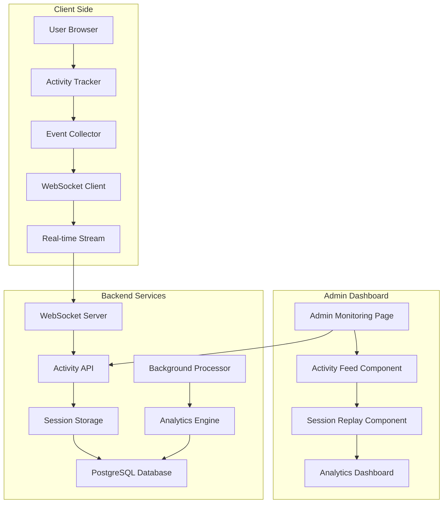

# Design Document

## Overview

The User Activity Monitoring system extends the existing ORBOH admin infrastructure to provide comprehensive user interaction tracking and screen-level recording capabilities. The design leverages the current admin dashboard structure, API patterns, and database schema while adding new monitoring components that integrate seamlessly with existing admin pages.

## Architecture

### System Architecture Overview



### Integration with Existing Admin Structure

The monitoring system extends the current admin dashboard (`app/admin/page.tsx`) by:
- Adding a new "ユーザー活動監視" card to the main dashboard
- Enhancing the existing monitoring page (`app/admin/monitoring/page.tsx`)
- Utilizing the existing admin authentication and API patterns
- Following the established UI component structure and styling

## Components and Interfaces

### Frontend Components

#### 1. Activity Tracking Client (`components/monitoring/ActivityTracker.tsx`)
```typescript
interface ActivityEvent {
  id: string
  userId: string
  sessionId: string
  timestamp: Date
  type: 'click' | 'scroll' | 'input' | 'navigation' | 'error'
  data: {
    element?: string
    coordinates?: { x: number, y: number }
    page: string
    viewport: { width: number, height: number }
    userAgent: string
  }
  sensitive?: boolean
}

interface ActivityTrackerProps {
  userId: string
  enabled: boolean
  excludeSelectors?: string[]
  maskSensitiveData?: boolean
}
```

#### 2. Admin Activity Feed (`components/monitoring/AdminActivityFeed.tsx`)
```typescript
interface ActivityFeedProps {
  realTime?: boolean
  userId?: string
  dateRange?: { start: Date, end: Date }
  filters?: ActivityFilters
}

interface ActivityFilters {
  eventTypes: string[]
  pages: string[]
  users: string[]
  errorOnly?: boolean
}
```

#### 3. Session Replay Viewer (`components/monitoring/SessionReplayViewer.tsx`)
```typescript
interface SessionReplayProps {
  sessionId: string
  events: ActivityEvent[]
  onTimelineChange?: (timestamp: number) => void
  playbackSpeed?: number
  showSensitiveData?: boolean
}

interface ReplayControls {
  play: () => void
  pause: () => void
  seek: (timestamp: number) => void
  setSpeed: (speed: number) => void
  toggleSensitiveData: () => void
}
```

#### 4. Enhanced Admin Monitoring Page (`app/admin/monitoring/page.tsx`)
```typescript
interface MonitoringPageState {
  activeUsers: UserSession[]
  selectedSession?: string
  filters: ActivityFilters
  realTimeEnabled: boolean
  alertRules: AlertRule[]
}

interface UserSession {
  id: string
  userId: string
  startTime: Date
  lastActivity: Date
  pageViews: number
  errors: number
  isActive: boolean
  currentPage: string
}
```

### Backend Components

#### 1. Activity Collection API (`app/api/admin/activity/route.ts`)
```typescript
interface ActivityCollectionEndpoint {
  POST: (events: ActivityEvent[]) => Promise<Response>
  GET: (filters: ActivityFilters) => Promise<ActivityEvent[]>
}

interface ActivityBatchRequest {
  events: ActivityEvent[]
  sessionId: string
  userId: string
  timestamp: Date
}
```

#### 2. Session Management API (`app/api/admin/sessions/route.ts`)
```typescript
interface SessionEndpoint {
  GET: (userId?: string) => Promise<UserSession[]>
  POST: (sessionData: SessionCreateRequest) => Promise<UserSession>
  DELETE: (sessionId: string) => Promise<void>
}

interface SessionCreateRequest {
  userId: string
  userAgent: string
  initialPage: string
  viewport: { width: number, height: number }
}
```

#### 3. WebSocket Activity Stream (`lib/websocket/activity-stream.ts`)
```typescript
interface ActivityWebSocketServer {
  onConnection: (socket: WebSocket) => void
  broadcastActivity: (event: ActivityEvent) => void
  subscribeToUser: (socket: WebSocket, userId: string) => void
  unsubscribe: (socket: WebSocket) => void
}

interface WebSocketMessage {
  type: 'activity' | 'session_start' | 'session_end' | 'error'
  data: ActivityEvent | UserSession | ErrorEvent
  timestamp: Date
}
```

## Data Models

### Database Schema Extensions

#### Activity Events Table
```sql
CREATE TABLE activity_events (
  id UUID PRIMARY KEY DEFAULT gen_random_uuid(),
  user_id UUID REFERENCES users(id) ON DELETE CASCADE,
  session_id UUID NOT NULL,
  event_type VARCHAR(50) NOT NULL,
  page_url TEXT NOT NULL,
  element_selector TEXT,
  coordinates JSONB,
  viewport JSONB NOT NULL,
  user_agent TEXT NOT NULL,
  event_data JSONB,
  is_sensitive BOOLEAN DEFAULT FALSE,
  created_at TIMESTAMP WITH TIME ZONE DEFAULT NOW(),
  
  INDEX idx_activity_user_time (user_id, created_at),
  INDEX idx_activity_session (session_id),
  INDEX idx_activity_type_time (event_type, created_at)
);
```

#### User Sessions Table
```sql
CREATE TABLE user_sessions (
  id UUID PRIMARY KEY DEFAULT gen_random_uuid(),
  user_id UUID REFERENCES users(id) ON DELETE CASCADE,
  session_start TIMESTAMP WITH TIME ZONE DEFAULT NOW(),
  session_end TIMESTAMP WITH TIME ZONE,
  last_activity TIMESTAMP WITH TIME ZONE DEFAULT NOW(),
  initial_page TEXT NOT NULL,
  final_page TEXT,
  total_events INTEGER DEFAULT 0,
  error_count INTEGER DEFAULT 0,
  user_agent TEXT NOT NULL,
  viewport JSONB NOT NULL,
  is_active BOOLEAN DEFAULT TRUE,
  
  INDEX idx_sessions_user_time (user_id, session_start),
  INDEX idx_sessions_active (is_active, last_activity)
);
```

#### Activity Alerts Table
```sql
CREATE TABLE activity_alerts (
  id UUID PRIMARY KEY DEFAULT gen_random_uuid(),
  name VARCHAR(255) NOT NULL,
  description TEXT,
  conditions JSONB NOT NULL,
  actions JSONB NOT NULL,
  is_active BOOLEAN DEFAULT TRUE,
  created_by UUID REFERENCES users(id),
  created_at TIMESTAMP WITH TIME ZONE DEFAULT NOW(),
  last_triggered TIMESTAMP WITH TIME ZONE,
  trigger_count INTEGER DEFAULT 0
);
```

### Prisma Schema Updates
```prisma
model ActivityEvent {
  id            String   @id @default(cuid())
  userId        String
  sessionId     String
  eventType     String
  pageUrl       String
  elementSelector String?
  coordinates   Json?
  viewport      Json
  userAgent     String
  eventData     Json?
  isSensitive   Boolean  @default(false)
  createdAt     DateTime @default(now())
  
  user          User     @relation(fields: [userId], references: [id], onDelete: Cascade)
  session       UserSession @relation(fields: [sessionId], references: [id], onDelete: Cascade)
  
  @@index([userId, createdAt])
  @@index([sessionId])
  @@index([eventType, createdAt])
  @@map("activity_events")
}

model UserSession {
  id            String   @id @default(cuid())
  userId        String
  sessionStart  DateTime @default(now())
  sessionEnd    DateTime?
  lastActivity  DateTime @default(now())
  initialPage   String
  finalPage     String?
  totalEvents   Int      @default(0)
  errorCount    Int      @default(0)
  userAgent     String
  viewport      Json
  isActive      Boolean  @default(true)
  
  user          User     @relation(fields: [userId], references: [id], onDelete: Cascade)
  events        ActivityEvent[]
  
  @@index([userId, sessionStart])
  @@index([isActive, lastActivity])
  @@map("user_sessions")
}

model ActivityAlert {
  id            String   @id @default(cuid())
  name          String
  description   String?
  conditions    Json
  actions       Json
  isActive      Boolean  @default(true)
  createdBy     String?
  createdAt     DateTime @default(now())
  lastTriggered DateTime?
  triggerCount  Int      @default(0)
  
  creator       User?    @relation(fields: [createdBy], references: [id])
  
  @@map("activity_alerts")
}
```

## Error Handling

### Client-Side Error Handling
- **Network failures**: Queue events locally and retry with exponential backoff
- **Privacy violations**: Automatically exclude sensitive data and log violations
- **Performance impact**: Throttle event collection based on system performance
- **Browser compatibility**: Graceful degradation for unsupported features

### Server-Side Error Handling
- **Database failures**: Implement circuit breaker pattern for database operations
- **WebSocket disconnections**: Automatic reconnection with session recovery
- **Memory management**: Implement event batching and cleanup for large datasets
- **Rate limiting**: Prevent abuse with per-user and per-session rate limits

### Error Recovery Strategies
```typescript
interface ErrorRecoveryConfig {
  maxRetries: number
  backoffMultiplier: number
  circuitBreakerThreshold: number
  sessionRecoveryTimeout: number
  eventQueueMaxSize: number
}

class ActivityErrorHandler {
  handleNetworkError(error: NetworkError): void
  handlePrivacyViolation(event: ActivityEvent): void
  handlePerformanceIssue(metrics: PerformanceMetrics): void
  recoverSession(sessionId: string): Promise<void>
}
```

## Testing Strategy

### Unit Testing
- **Component testing**: Test all React components with React Testing Library
- **API testing**: Test all endpoints with Jest and supertest
- **Utility testing**: Test data processing and validation functions
- **WebSocket testing**: Mock WebSocket connections for real-time features

### Integration Testing
- **End-to-end activity tracking**: Test complete user interaction capture flow
- **Admin dashboard integration**: Test monitoring interface with real data
- **Database operations**: Test complex queries and data relationships
- **Privacy compliance**: Test sensitive data masking and exclusion

### Performance Testing
- **Event collection overhead**: Measure impact on user experience
- **Database query performance**: Test with large datasets
- **WebSocket scalability**: Test concurrent connection limits
- **Memory usage**: Monitor for memory leaks in long-running sessions

### Security Testing
- **Data privacy**: Verify sensitive data is properly masked
- **Access control**: Test admin-only access restrictions
- **Input validation**: Test against malicious event data
- **Rate limiting**: Verify protection against abuse

### Test Implementation Structure
```typescript
// Unit Tests
describe('ActivityTracker', () => {
  test('captures click events correctly')
  test('excludes sensitive data')
  test('handles network failures gracefully')
})

// Integration Tests
describe('Activity Monitoring Flow', () => {
  test('complete user session recording')
  test('admin dashboard real-time updates')
  test('session replay functionality')
})

// E2E Tests
describe('Admin Monitoring Interface', () => {
  test('admin can view user activities')
  test('session replay works correctly')
  test('privacy controls function properly')
})
```

## Privacy and Security Considerations

### Data Privacy Implementation
- **Automatic PII detection**: Use regex patterns and ML models to identify sensitive data
- **Field-level masking**: Mask specific input fields (passwords, credit cards, etc.)
- **Consent management**: Integrate with existing user consent systems
- **Data retention**: Implement automatic cleanup based on configurable retention periods

### Security Measures
- **Encryption**: All activity data encrypted at rest and in transit
- **Access control**: Admin-only access with role-based permissions
- **Audit logging**: Track all admin access to monitoring data
- **Data anonymization**: Option to anonymize data for analytics purposes

### Compliance Features
```typescript
interface PrivacyConfig {
  enableDataCollection: boolean
  maskSensitiveFields: string[]
  retentionPeriodDays: number
  anonymizeAfterDays: number
  requireExplicitConsent: boolean
  allowDataExport: boolean
  allowDataDeletion: boolean
}

class PrivacyManager {
  checkConsent(userId: string): Promise<boolean>
  maskSensitiveData(event: ActivityEvent): ActivityEvent
  scheduleDataCleanup(retentionDays: number): void
  handleDataDeletionRequest(userId: string): Promise<void>
}
```

## Performance Optimization

### Client-Side Optimization
- **Event batching**: Collect events in batches to reduce network requests
- **Throttling**: Limit high-frequency events (mouse movements, scrolling)
- **Lazy loading**: Load monitoring components only when needed
- **Memory management**: Clean up event listeners and data structures

### Server-Side Optimization
- **Database indexing**: Optimize queries with proper indexes
- **Caching**: Cache frequently accessed session data
- **Background processing**: Process analytics in background jobs
- **Connection pooling**: Manage WebSocket connections efficiently

### Scalability Considerations
```typescript
interface PerformanceConfig {
  eventBatchSize: number
  eventBatchInterval: number
  maxEventsPerSession: number
  maxConcurrentSessions: number
  cacheExpirationMinutes: number
  backgroundJobInterval: number
}

class PerformanceMonitor {
  trackEventProcessingTime(): void
  monitorMemoryUsage(): void
  optimizeQueryPerformance(): void
  manageConnectionPool(): void
}
```